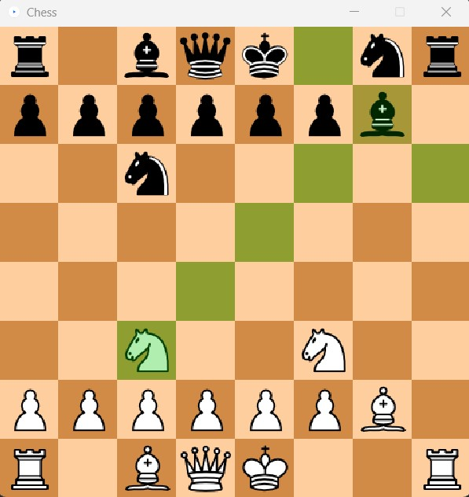

# Chess in Java
The purpose of this project is just to hone my Java skills.
The game is by no means perfect/complete, but it has all the basic movements, plus some of the more advanced (coding-wise) mechanics of chess, like check (mostly)
Pawns are a little bit broken at the moment...
Here's a screenshot of the game in action;

